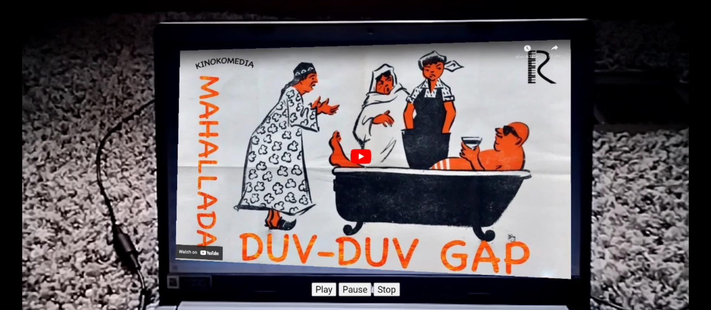

# Projecting Youtube Videos on Web AR


### **Description / Rationale**
This is a small project, which demonstrates one of the most popular requested features - the possibility of projecting Youtube videos on web based augmented reality powered by MindAR.js and AFrame. The project uses slightly modified version of <a href="https://github.com/ryota-mitarai/aframe-websurfaces">AFrame Websurfaces component created by Ryota Mitarai</a> in combination with world to local matrix transforms powered by Three.js/AFrame.  

### **Instructions**
To see the project at work just copy the repository to your local server and explore all the functionality. To change video and its size, just insert Youtube embedded video url and define its width and height (for more information on websurfaces component, please refer to the original component):
```
websurface="url:https://www.youtube.com/embed/L6iKapYgN94; width:3.5; height:2.0;"
```
Target image for tracking is located at "img" folder. Also make sure to reference custom AFrame Websurfaces component, available at "js" folder.

### **Tech Stack**
The project is powered by MindAR.js, AFrame and Three.js. CSS3d Renderer features are made available through Websurfaces component.

<b>Please note:</b> CSS3d will not work in web VR mode!

### **Demo**
To see the application at work: [Demo application](https://webar-youtube.glitch.me/)
